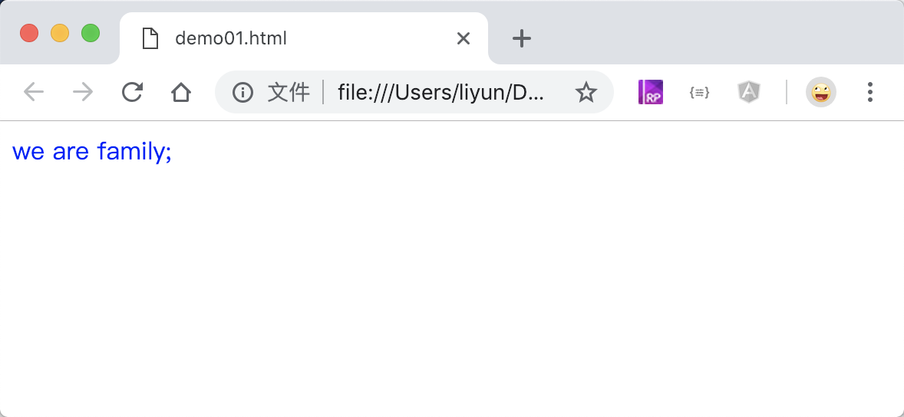
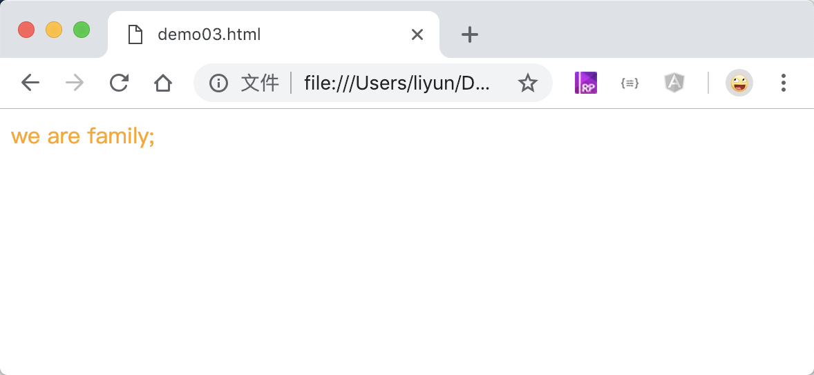

# CSS 语法基础

CSS 的语法格式为：

```css
选择器{
    属性：属性值;
}
```

比如说`把头发的颜色染成蓝色`这句话中，“头发”是选择器，表示一个对象，“颜色”是属性，“蓝色”是属性值。

换到 HTML 页面中`把p标签中的文字颜色设置为蓝色`，就可以这么写

> `color`在 CSS 中表示颜色的属性。

```css
p {
    color: blue;
}
```

## CSS 的位置

CSS 样式一般可以写在三个位置上。

1.行内样式(也叫内联样式)：写在元素开始标签上的`style`属性中，这里的样式可以不写`选择器`。

```html
<p style="color: blue;">we are family;</p>
```

[案例源码](./demo/demo01.html)



2.页面样式：写在`<head>`标签中的`<style>`标签中：

```html
<html>
    <head>
        <style>
            p {
                color: blue;
            }
        </style>
    </head>
    <body>
        <p>we are family;</p>
    </body>
</html>
```

[案例源码](./demo/demo02.html)


3.外联样式：在`<head>`标签中通过`<link>`标签引入外部的`.css`文件

> `<link>`标签使用`rel='stylesheet'`属性告诉浏览器这里引入的是一个 CSS 样式文件，`href=""`属性指定 css 文件的路径

`index.css`

```css
p {
    color: blue;
}
```

`index.html`

```html
<html>
    <head>
        <link rel="stylesheet" href="./index.css" />
    </head>
    <body>
        <p>we are family;</p>
    </body>
</html>
```

[案例源码](./demo/demo03.html)



## CSS 注释

和 HTML 一样。CSS 也有一些文字是给开发人员看的，可使用`/* 内容 */`注释掉，这个格式可以注释单行文字，也可以注释多行文字

```css
/* 注释单行文本 */

/* 
注释多行文本
注释多行文本 
*/
```
