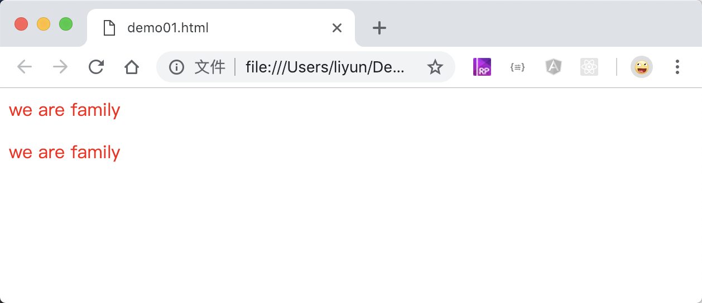
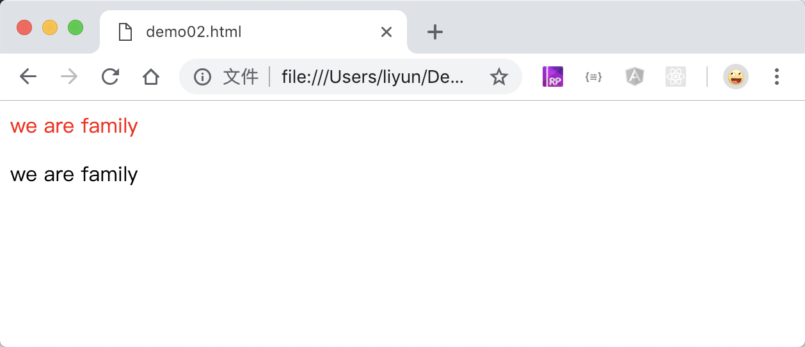
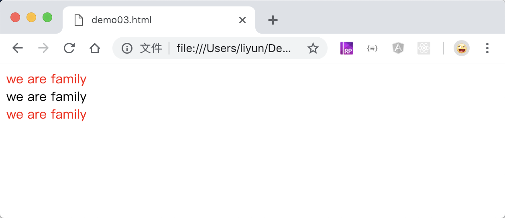
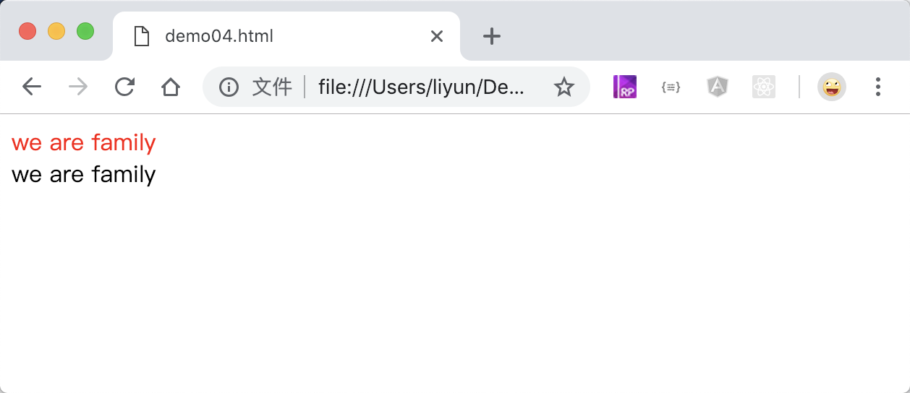

## CSS 基础选择器

CSS 中的选择器大体分为以下几种：

-   通配符
-   标签选择器，通过元素的标签名作为选择器
-   类名选择器，通过元素的 clas 属性值作为选择器
-   id 选择器，通过元素的 id 属性值作为选择器
-   属性选择器，通过元素的某个属性作为选择器
-   伪类/伪元素选择器，通过元素的状态作为选择器

本章讲一下 4 种基础选择器：

## 通配符

通配符`*`，作为选择器的时候，表示页面内的所有样式都会使用大括号中的样式。

```html
<style>
    * {
        color: red;
    }
</style>

<p>we are family</p>
<div>we are family</div>
```

[案例源码](./demo/demo01.html)



## 标签选择器

只有相同标签的元素，才会使用大括号中的样式

```html
<style>
    p {
        color: red;
    }
</style>

<p>we are family</p>
<div>we are family</div>
```

[案例源码](./demo/demo02.html)



## 类名选择器

元素的`class`属性中可以同时定义多个值，分别用`空格`隔开； 一个页面中允许元素的`class`属性值相同，可以利用这一点，给页面不同的元素使用相同的样式

使用 `class属性值`作为选择器时，需要使用`.类名`的格式。只有元素的`class`属性值，包含选择器中的名称时，才会使用大括号中的样式，

```html
<style>
    .d1 {
        color: red;
    }
</style>

<div class="d1">we are family</div>
<div>we are family</div>
<div class="d1">we are family</div>
```

[案例源码](./demo/demo03.html)



## id 选择器

元素的`id`属性中只能定义一个值，一个元素的 id 属性值，必须在页面中是唯一的，不允许重复。

使用 `id属性值`作为选择器时，需要使用`#类名`的格式。只有元素的 `id` 属性值相同时，才会使用大括号中的样式，

```html
<style>
    #d1 {
        color: red;
    }
</style>

<div id="d1">we are family</div>
<div>we are family</div>
```

[案例源码](./demo/demo04.html)


