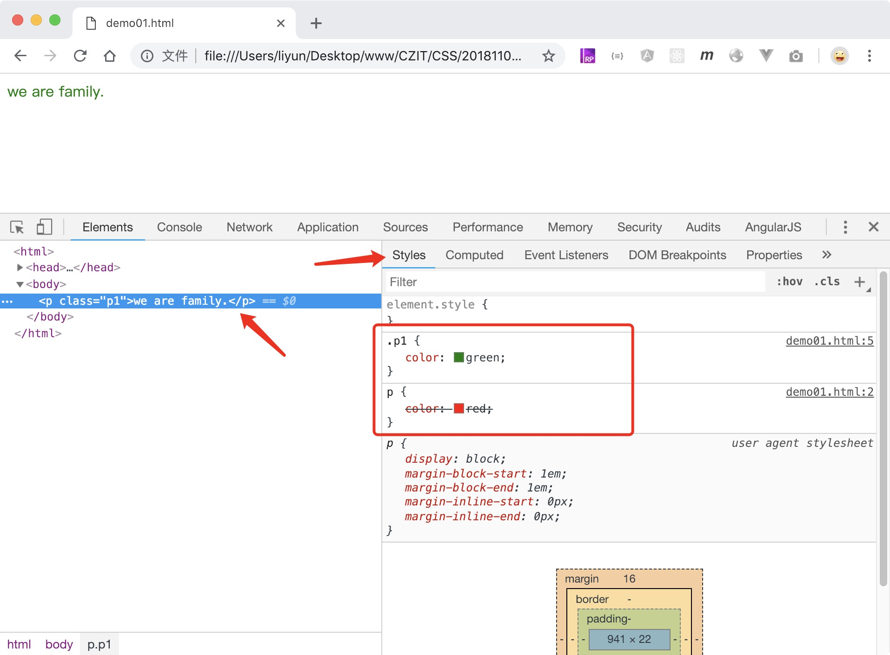
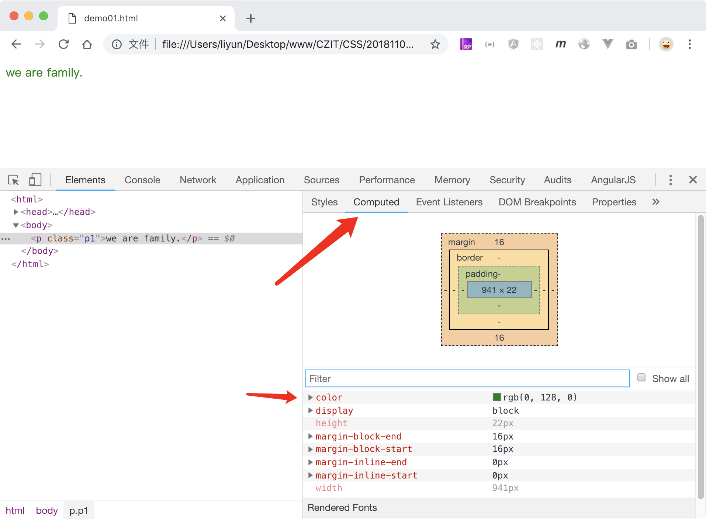

# 用开发者工具查看元素样式

每个浏览器都提供了一个“开发者工具”，便于网站开发人员在工作时进行调试。以`chrome`浏览器为例，通过按下`F12`键可以打开“开发者工具”(以下简称“工具”)。

> 不同的浏览器打开方式可能有所不同，但大多可以通过“右键-检查元素”来打开工具。

```html
<style>
    p {
        color: red;
    }
    .p1 {
        color: green;
    }
</style>
<p class="p1">we are family.</p>
```

上面的案例，在浏览器中打开后，右键菜单中选择“检查”后打开工具。在`element`面板中选择`p元素在`，`styles`面板中可看到页面中为 p 元素定义的所有样式：



`computed`面板中可以看到经过浏览器最终计算之后 p 元素的最终样式



从工具面板中可以看出，`style`标签中用两种选择器都给 p 元素设置了颜色，经过浏览器计算后，最终的结果使用了其中的一个颜色。这个最终结果和“样式的优先级”有关。样式的优先级会在下一篇文章说。
