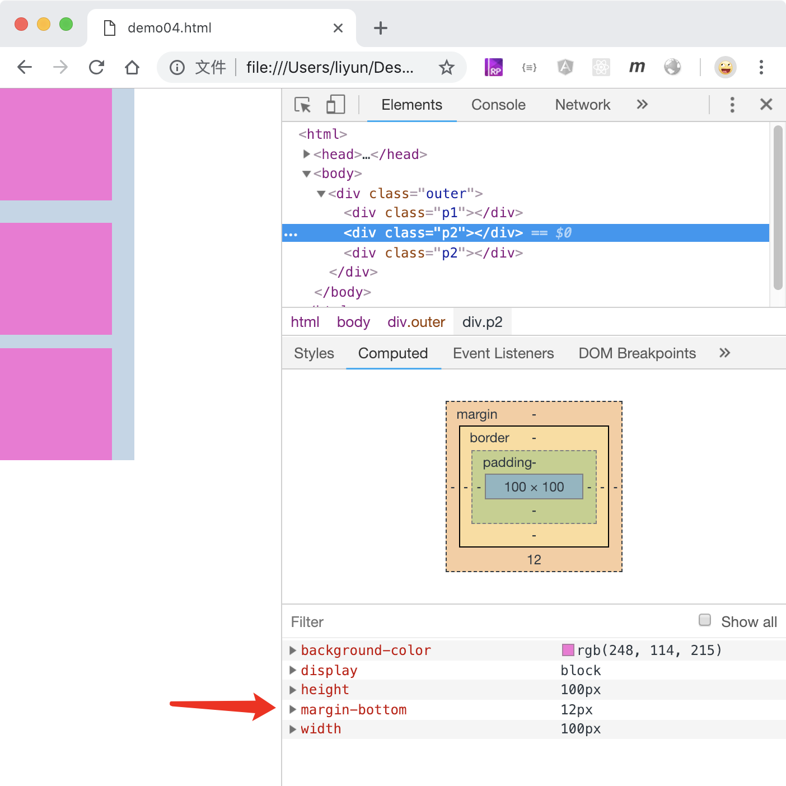
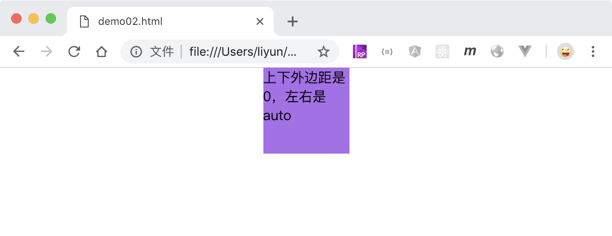

# 外边距

`margin`属性用来设置元素与元素之间的距离，称为外边距。支持以下几种写法：

-   `margin: 统一设置`
-   `margin: 上下外边距 左右外边距`
-   `margin: 上外边距 右外边距 下外边距 左外边距`
-   `margin-top: 上外边距`
-   `margin-right: 右外边距`
-   `margin-bottom: 下外边距`
-   `margin-left: 左外边距`

外边距的可用值有以下几种：

| 属性值 | 作用                                                 |
| ------ | ---------------------------------------------------- |
| length | 使用`px em rem`等尺寸单位                            |
| %      | 四个方向的外边距均已`父级元素宽度的百分比`设置外边距 |
| auto   | 让浏览器自动计算 `margin` 值                         |

> `body`元素上在浏览器中都会有一个默认的外边距，不同浏览器的默认外边距可能不同，通常给`body`元素设置`margin:0;`来清除默认的外边距

```html
<style>
    body {
        margin: 0;
    }
    div {
        width: 100px;
        height: 100px;
        background-color: rgb(248, 114, 215);
    }
    .p1 {
        margin-bottom: 20px;
    }
</style>
<div class="p1"></div>
<div class="p2"></div>
```

[案例源码](./demo/demo01.html)



## 使用`auto`让元素水平居中

`margin`的`auto`属性值可以让元素水平方向居中显示

```html
<style>
    body {
        margin: 0;
    }
    div {
        width: 100px;
        height: 100px;
        background-color: rgb(172, 106, 235);
        margin: 0 auto;
    }
</style>
<div>上下外边距是0，左右是auto</div>
```

[案例源码](./demo/demo02.html)


