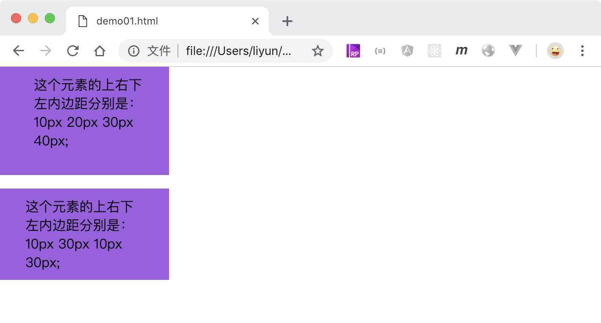

# 内边距

`padding`属性用来设置元素的内边距，也就是硬纸盒与手机之间的泡沫部分，支持以下几种写法：

-   `padding: 统一设置`
-   `padding: 上下内边距 左右内边距`
-   `padding: 上内边距 右内边距 下内边距 左内边距`
-   `padding-top: 上内边距`
-   `padding-right: 右内边距`
-   `padding-bottom: 下内边距`
-   `padding-left: 左内边距`

| 属性值 | 作用                                             |
| ------ | ------------------------------------------------ |
| length | 以`px em rem`等尺寸单位                          |
| %      | 四个方向的内边距均已`父级元素宽度的百分比`来设置 |

```html
<style>
    body {
        margin: 0;
    }
    div {
        width: 200px;
        background-color: rgb(193, 214, 231);
    }
    .p1 p {
        padding: 10px 20px 30px 40px;
        background-color: rgb(160, 89, 226);
    }
    .p2 p {
        padding: 10px 30px;
        background-color: rgb(160, 89, 226);
    }
</style>
<div class="p1">
    <p>这个元素的上右下左内边距分别是：<br />10px 20px 30px 40px;</p>
</div>
<div class="p2">
    <p>这个元素的上右下左内边距分别是：<br />10px 30px 10px 30px;</p>
</div>
```

[案例源码](./demo/demo01.html)


